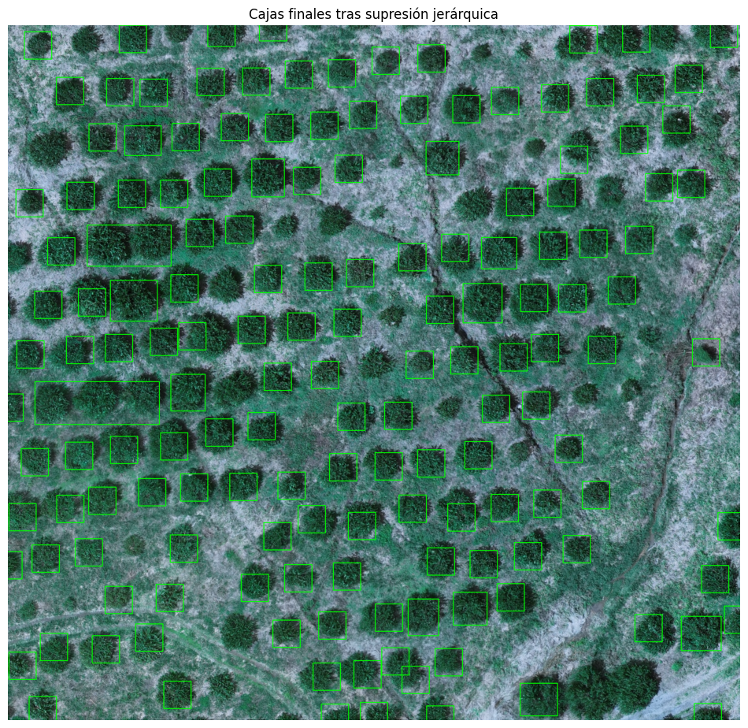
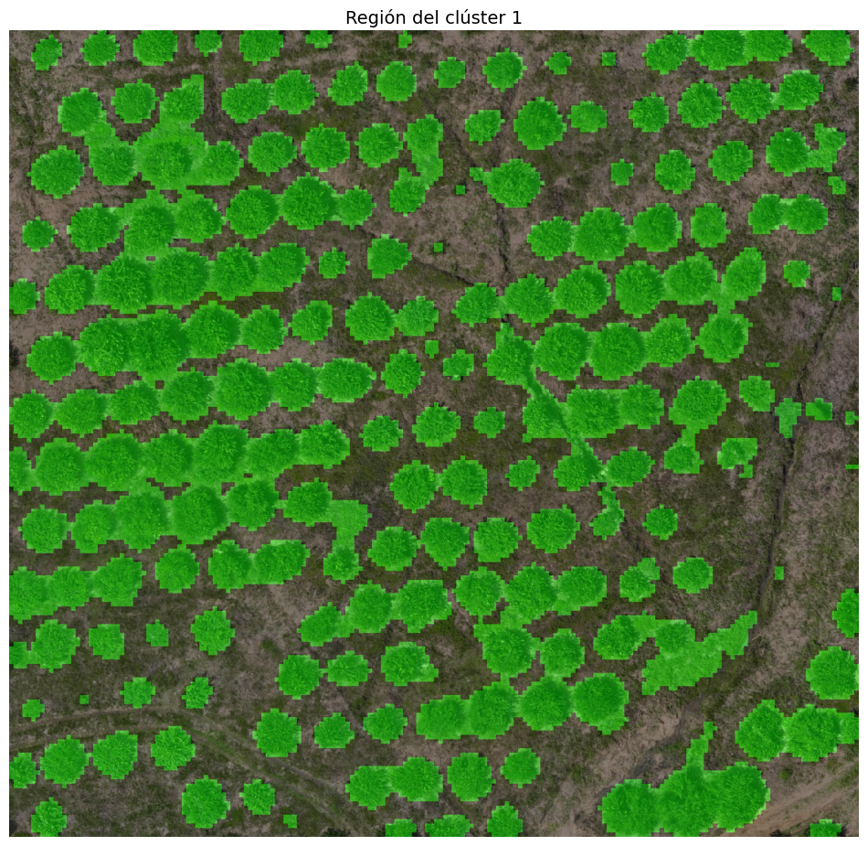
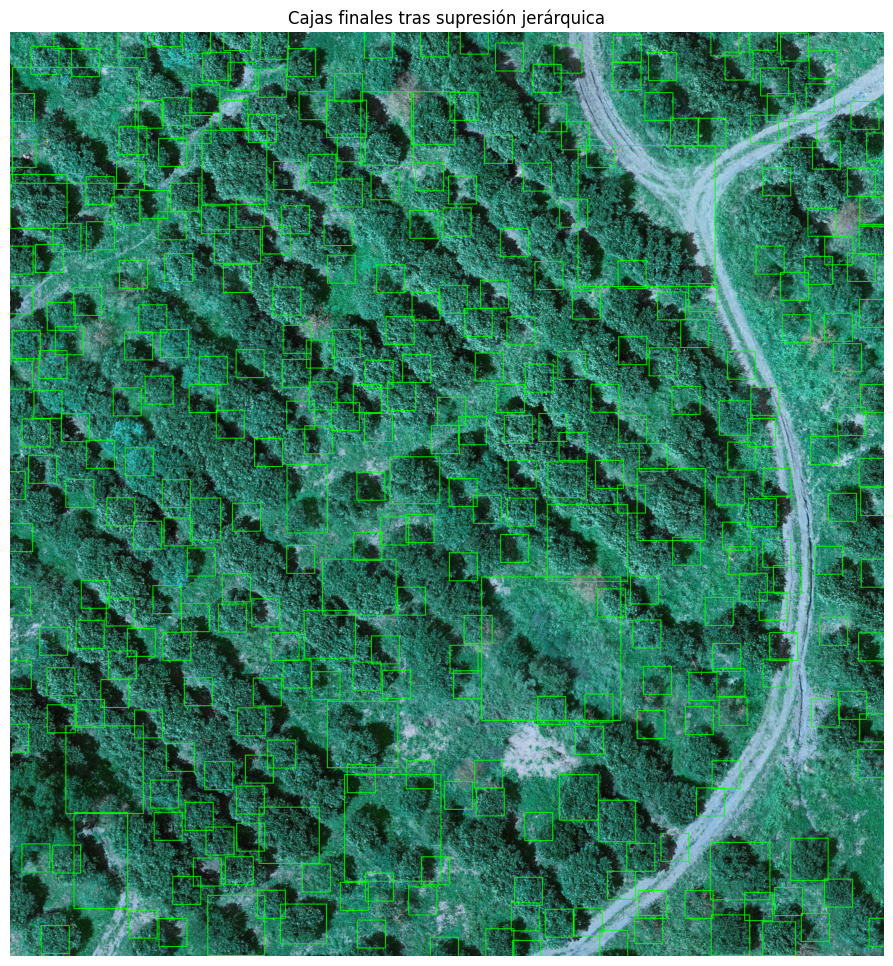
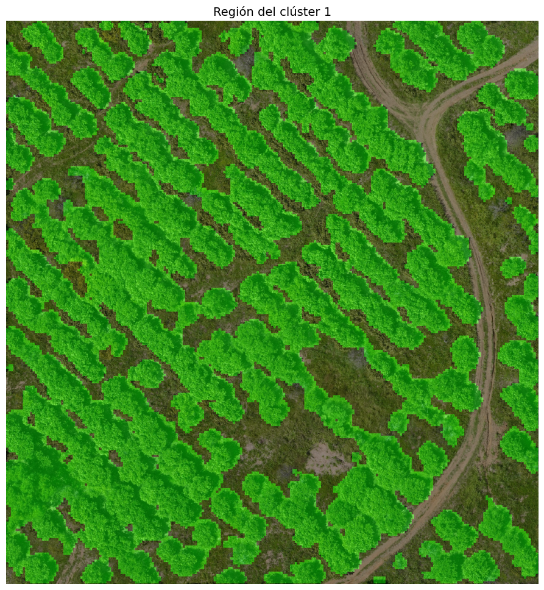
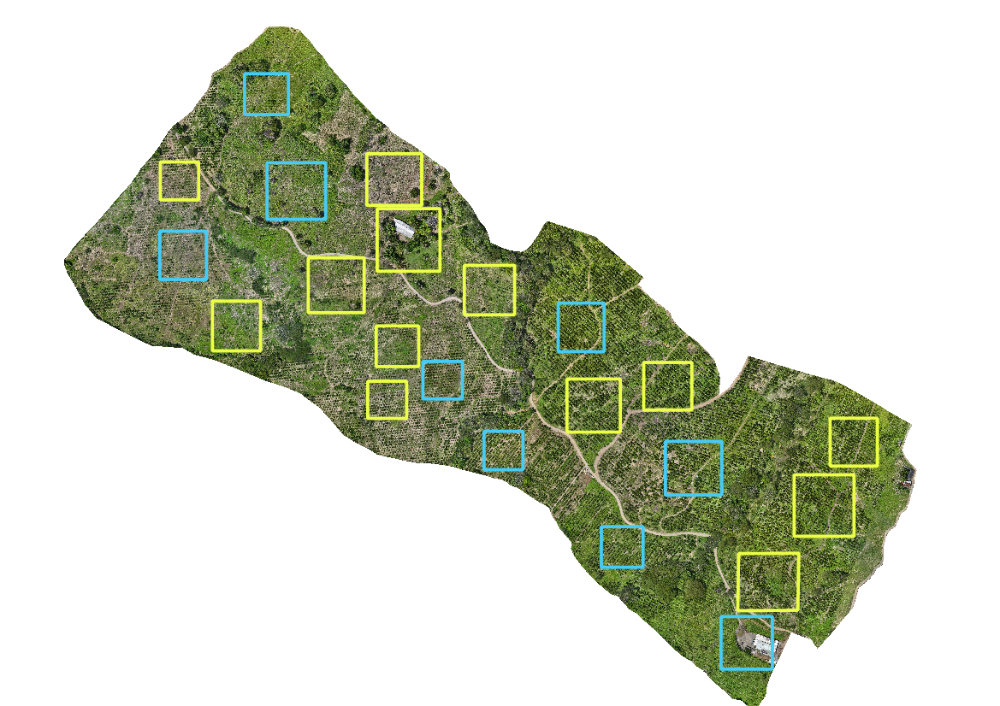
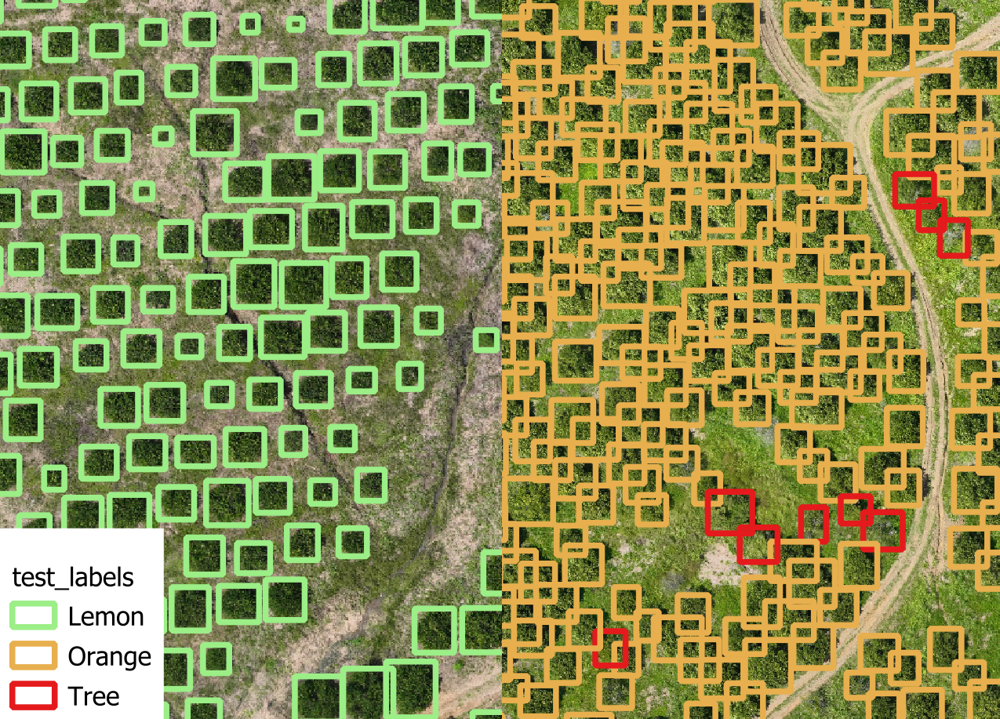
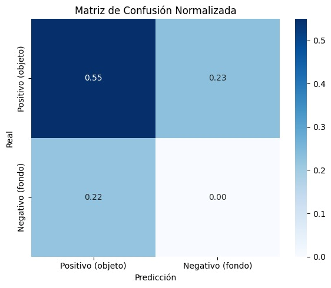

# citrus3-detector
## Detección y Conteo automático de Árboles Cítricos a partir de Imágenes Aéreas

Este proyecto busca automatizar la identificación y conteo de **árboles de naranja y limón** en parcelas agrícolas usando imágenes adquiridas con **drones** y un **modelo de detección de objetos previamente entrenado**. Está desarrollado siguiendo la metodología **CRISP-DM**, y se enfoca en facilitar la toma de decisiones agronómicas aprovechando los desarrollos de la visión por computador.
| | |
|-|-|
|  |  |
|  |  |

---

## 🧠 Metodología CRISP-DM

### 1. Comprensión del Negocio

- **Objetivo**: Automatizar el conteo y localización de árboles cítricos (naranja y limón) a partir de imágenes aéreas.
- **Motivación**: Reducir tiempos y automatizar el monitoreo de cultivos. Permitir el análisis del terreno y facilitar tareas de inventario.
- **Área de análisis**: 93 hectáreas, con presencia mayoritaria de cítricos y elementos adicionales como árboles nativos, viviendas, rocas y caminos.

---

### 2. Comprensión de los Datos

- **Fuente**: Imágenes RGB obtenidas mediante un vuelo de dron, con calibración geométrica y radiométrica. 
- **Formato**: Ortomosaicos georreferenciados (formato raster, GeoTIFF).
- **Generación de dataset**: Selección de áreas que cubran la heterogeneidad de las coberturas presentes.
  
- **Contenido**:
   - Árboles cítricos (objetivo)
   - Elementos no relevantes para el problema: árboles nativos, casas, caminos, sombras
#### 🏷️ Etiquetas reales: 
El proyecto cuenta con un conjunto de 2,094 anotaciones manuales realizadas sobre las áreas de Test, distribuidas en tres clases:
   - 740 para árboles de limón
   - 1,251 para árboles de naranja
   - 103 para la clase "arbol", que incluye:
      - Especies arbóreas que no son limón o naraja.
      - Individuos cuyo tipo (limón o naranja) no pudo determinarse con claridad.
      - Árboles secos o muertos que aún conservan estructura visible.


Las etiquetas están disponibles en formato CSV, JSON y Shapefile, en las siguientes rutas:

- CSV y JSON:
   `data/labels/labels_tifname_porcentual.csv`
   `data/labels/test-labels.json`

- Shapefile:
   `data/shapefiles/Hard_Labels`

📄 **Ejemplo del archivo CSV**
El archivo CSV contiene las coordenadas normalizadas de las cajas delimitadoras (entre 0-100), lo que permite escalarlas a cualquier resolución de imagen. A continuación, se muestra un ejemplo del csv:

| image_path           | xmin   | ymin   | xmax   | ymax   | label  |
|----------------------|--------|--------|--------|--------|--------|
| database_batch_4.tif | 55.990 | 74.683 | 60.737 | 79.736 | Lemon  |
| database_batch_7.tif | 36.290 |  6.161 | 42.207 | 12.145 | Orange |
| database_batch_14.tif| 80.001 | 96.597 | 82.240 | 99.476 | Tree   |

-  **Descripción de las columnas**
   - `image_path`: Imagen a la que corresponde cada anotación. Encontradas en la ruta `data/database/test/tif_1x_res`
   - `x_min`, `y_min`: Coordenadas normalizadas de la esquina superior izquierda del rectángulo
   - `x_max`, `y_max`: Coordenadas normalizadas de la esquina inferior derecha del rectángulo
   - `label`: Clase asignada: `Lemon`, `Orange` o `Tree` 

---

## 🧩 Flujo de Modelado 
1. **División en parches y extracción de características**
   - Cada imagen se divide en parches
   - Para cada parche se calculan estadísticas (histograma de color en RGB/HSV)
   - *Hiperparámetros*: tamaño del parche, stride (salto entre parches), espacio de color

2. **Clustering de características**
   - Se entrena un modelo KNN con todos los parches de entrenamiento
   - Se concatenan características (histogramas) para robustez
   - *Hiperparámetro*: número de clusters

3. **Selección de clusters relevantes**
   - Análisis humano de histogramas por cluster
   - Selección de clusters que representan árboles cítricos

4. **Generación de máscaras**
   - Nueva división de imágenes en parches
   - Clasificación con el KNN entrenado
   - Creación de máscaras binarias seleccionando clusters relevantes

5. **Procesamiento morfológico**
   - Erosión de máscaras con kernel cruz

6. **Integración con datos de elevación**
   - Alineación y preprocesado de imagen de elevación:
     - Suavizado con filtro gaussiano
     - Detección de elevaciones puntuales (elevación - suavizado)
     - Filtrado por umbrales (5 opciones para umbral mínimo, máximo constante)
   - Multiplicación de máscaras por elevación filtrada
   - Detección de rectángulos y centroides por capa de elevación
   - *Ventaja*: Reduce influencia de vegetación baja y separa copas superpuestas

7. **Supresión no máxima jerárquica**
   - Eliminación de duplicados por IoU
   - Prioridad a capas con mayor umbral de elevación
   - *Hiperparámetro*: threshold de IoU

8. **Optimización y evaluación**
   - Ajuste de hiperparámetros con imágenes de validación
   - Evaluación final con imágenes de test

---

### 🧠 Ventajas del Enfoque

- **Robustez**: Combinación de características visuales y de elevación
- **Flexibilidad**: Adaptable a diferentes condiciones de cultivo
- **Eficiencia**: Procesamiento por etapas para manejo de grandes áreas

---

### 🧪 Estrategia de Evaluación
- **Métricas**:
  - Matriz de confusión a partir de IoU al 0.1
  - Precisión (Precision)
  - Exhaustividad (Recall)
  - F1-Score
  - Error absoluto en conteo absoluto (MAE) y porcentual (% MAE)
- **Evaluación espacial**:
  - Visualización sobre QGIS para validación geoespacial. Las etiquetas predichas por el modelo las puedes encontrar en formato `csv` y `json` para los conjuntos de entrenamiento, validación y prueba en la carpeta `data/results/predictions` y en formato `shapefile` en la carpeta `data/shapefiles/Predicted_Labels`

#### 📊 Resultados en el conjunto de prueba

| Métrica     | Valor |
|-------------|-------|
| Precision   | 0.65  |
| Recall      | 0.67  |
| F1-Score    | 0.66  |
| MAE         | 70.2  |
| % MAE       | 31.2% |


---

### ⚙️ Entorno de Desarrollo
- **Lenguaje**: Python 3.10+
- **Librerías clave**:
  - `opencv`, `scikit-image` (procesamiento de imágenes)
  - `scikit-learn` (KNN y clustering)
  - `geopandas`, `rasterio`, `shapely` (datos geoespaciales)
  - `QGIS` (visualización y análisis espacial)

---
## 📂 Estructura Actual del Proyecto

```bash
citrus3-detector/
├── data/
│   ├── database/ # Imagenes que conforman la base de datos, extraidas del ortomosaico
│   │   ├── databaste_atributes.xlsx # Archivo de excel con datos adicionales sobre las imágenes que conforman del database
│   │   ├── test/ # Imagenes de prueba a diferentes resoluciones y formatos, en RGB y modelo de elevación
│   │   │   ├── png_1x res/
│   │   │   ├── png_4x_res/
│   │   │   ├── tif_1x_res/
│   │   │   ├── tif_elev/
│   │   │   └── tif_x4_res/
│   │   ├── train/ # Imagenes de entrenamiento a diferentes resoluciones y formatos, en RGB y modelo de elevación
│   │   │   ├── png_high_res/
│   │   │   ├── tif_elev/
│   │   │   ├── tif_high_res/
│   │   │   └── tif_x4_res/
│   ├── labels/ # Etiquetas rectangulares hechas en el conjunto de prueba en formato csv y json
│   ├── results/ # Algunos resultados como segmentaciones, identificación de bounding boxes y filtrado de copas por mapa de elvación
│   │   │   └── predictions/ # Json y csv de las etiquetas predichas por el modelo
│   ├── samples/ # Imágenes de ejemplo (.tif)
│   └── shapefiles/ # Archivos .shp georreferenciados
│   │   │   ├── Hard_Labels/ # Shapes de etiquetas hechas a mano
│   │   │   ├── Predicted_Labels/ # Shapes de etiquetas predichas por el modelo en entrenamiento y prueba
├── models/ 
│   └── modelo_rgb.joblib # Modelo k-NN en espacio de color RGB entrenado
├── notebooks/
│   ├── Tree_Detection_Validation.ipynb # Ajuste del modelo y métricas
│   ├── Tree_Detection_Train.ipynb # Entrenamiento del modelo
│   └── Tree_Detection_Test.ipynb # Métricas de desempeño
│       └── Testing/ # Notebooks adicionales
│           ├── EDA_Citrus Elevation.ipynb # Pruebas iniciales de división de parches y exploración del espacio RGB y de elevación
│           ├── Knn_Segmentation.ipynb # Exploración de las caractaerísticas de color por parches de imágenees de prueba
│           ├── labeling.ipynb # Tareas asociadas al etiquetado y anpalisis de etiquetas
│           └── Testing_KNN.ipynb # Pruebas de k-NN con imágenes de prueba en RGB
├── requirements.txt        # Dependencias
└── README.md               # Este documento

